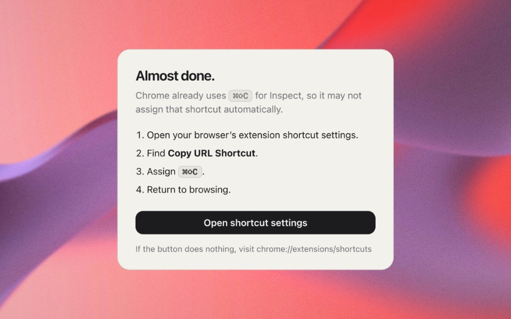

# Copy URL Shortcut

I used Arc for years. Copying the current tab with ⌘⇧C became muscle memory, one of those tiny things you stop noticing until it is gone.

When I moved to Chromium after Arc was sunset, my hands kept hitting the shortcut. Nothing happened. Everything I found was a bigger product than I wanted: always-on scripts, URL rewriting, settings panels. I built this so that one interaction still exists.

Press ⌘⇧C. The current URL is copied exactly. A small **Link copied** confirmation appears, then it disappears.

Inspired by Arc's ⌘⇧C Copy URL shortcut. Not affiliated with The Browser Company or Arc.


After install, a short setup page opens because Chrome already uses ⌘⇧C for Inspect:



## Why this one?

- Open source (MIT)
- No tracking
- No persistent content scripts
- No URL rewriting
- Wakes only when invoked

## Install

1. Clone the repo, or download the source.
2. Open `chrome://extensions`.
3. Turn on **Developer mode**.
4. Click **Load unpacked** and select this folder (the one that contains `manifest.json`).
5. Open `chrome://extensions/shortcuts`.
6. Find **Copy URL Shortcut** and assign ⌘⇧C (Ctrl+Shift+C on Windows and Linux).

Chrome already uses that shortcut for Inspect, so the one-time manual assignment is required. After you assign it, Chromium gives the extension shortcut priority.

Clicking the toolbar icon copies the same way if you would rather not use a shortcut.

## How it works

Unlike extensions that inject a keyboard listener into every page, Copy URL Shortcut has no persistent content script. Its Manifest V3 service worker wakes when you invoke the command, copies the current URL verbatim, injects a brief confirmation, and becomes idle again.

No persistent per-page runtime. Dormant by design.

This does not mean other approaches are meaningfully slow; their overhead is already small. It simply means this extension avoids persistent per-page runtime entirely because the feature does not require one.

Restricted browser pages cannot show the in-page confirmation. The URL is still copied, and the toolbar briefly shows ✓.

## Comparison

✓ is a yes for that column. "No" is a gap.

| | Copy URL Shortcut | [JamesHemery/arc-copy-chrome](https://github.com/JamesHemery/arc-copy-chrome) | [wagmiCTO/chrome-ctrl-shift-c](https://github.com/wagmiCTO/chrome-ctrl-shift-c) | [limonkufu/copy-current-url](https://github.com/limonkufu/copy-current-url) |
|---|---|---|---|---|
| Open-source license | ✓ MIT | No license found | MIT | MIT |
| Maintained | ✓ | Archived | Public repo | Public repo |
| MV3 event-driven command | ✓ | ✓ | ✓ | ✓ |
| No persistent content script | ✓ | ✓ | No (`<all_urls>`) | No (`<all_urls>`) |
| No per-page key listener | ✓ | ✓ | No | No |
| No per-page storage listener | ✓ | ✓ | No | No |
| URL copied verbatim | ✓ | ✓ | ✓ | No (tracker stripping) |
| No settings panel | ✓ | ✓ | No | No |
| Injects only when you copy | ✓ one shot | two injections | always resident | always resident |
| Clipboard API | ✓ | No (`execCommand`) | ✓ | ✓ |
| Restricted-page fallback | ✓ offscreen + badge | offscreen | offscreen + badge | No |

Several URL-copy extensions keep a content script and keyboard listener loaded in every page so they can catch a custom shortcut. This extension delegates shortcuts to Chromium's native Commands API instead. Nothing is injected into a webpage until you actually copy its URL.

## Development

Load unpacked from `chrome://extensions` with Developer mode enabled.

```sh
npm test
```

There are no runtime dependencies. `package.json` exists only so tests and the service worker can share standard ES modules.

Package a zip for the Chrome Web Store:

```sh
store/package.sh
```

## License

MIT.

Built by [Akin](https://akincankilic.com) with ♥
