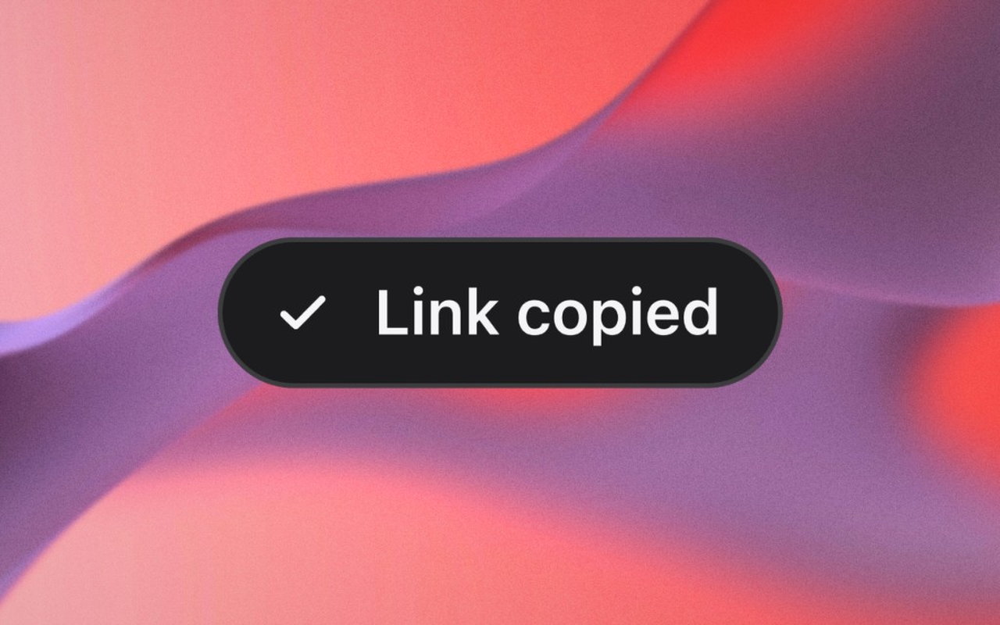
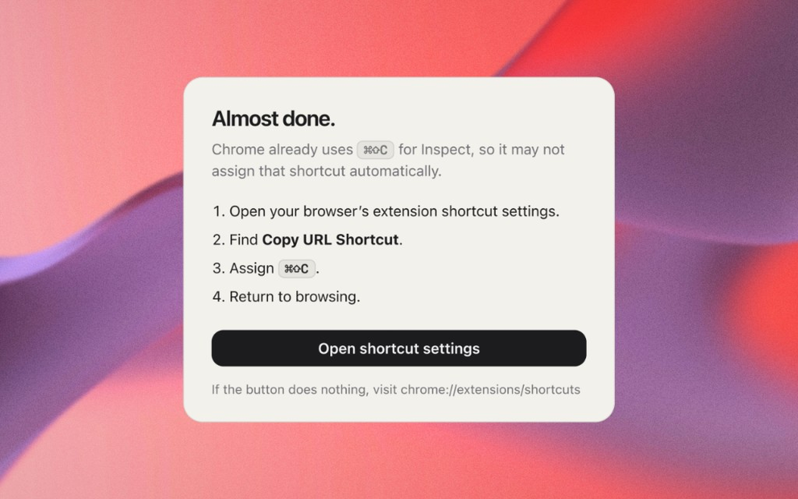
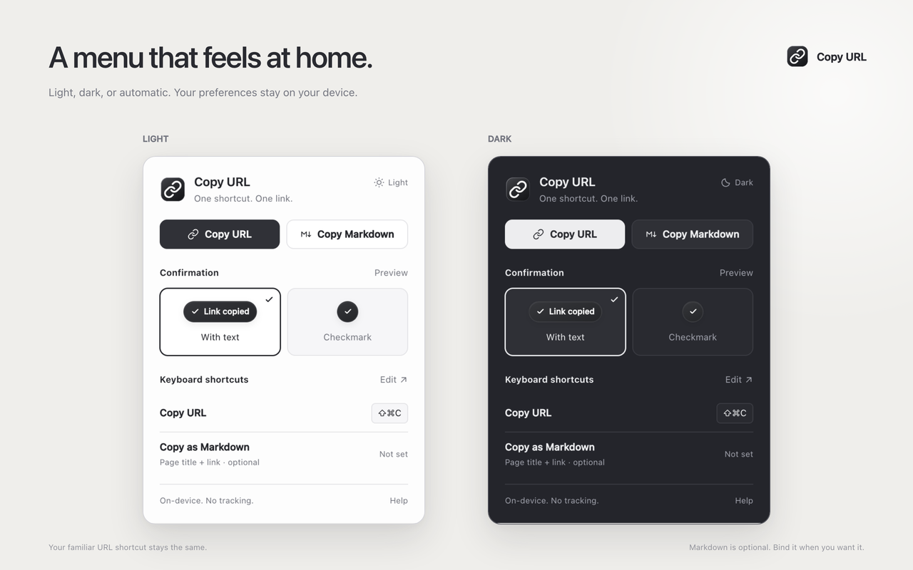
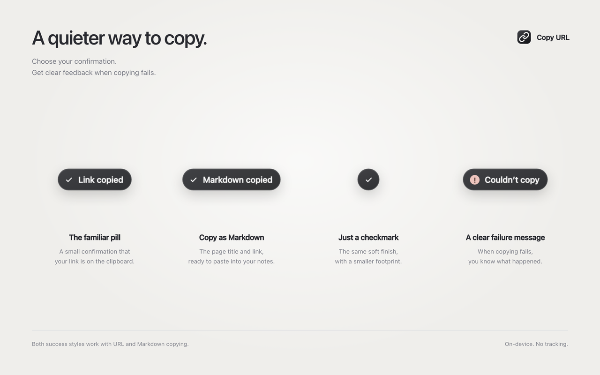

# Copy URL Shortcut

I used Arc for years. Copying the current tab with ⌘⇧C became muscle memory, one of those tiny things you stop noticing until it is gone.

When I moved to Chromium after Arc was sunset, my hands kept hitting the shortcut. Nothing happened. Everything I found was a bigger product than I wanted: always-on scripts, URL rewriting, settings panels. I built this so that one interaction still exists.

Press ⌘⇧C. The current URL is copied exactly, including query parameters and fragments. A small **Link copied** confirmation appears, then disappears.

Inspired by Arc's ⌘⇧C Copy URL shortcut. Not affiliated with The Browser Company or Arc.



After install, a short setup page opens because Chrome already uses ⌘⇧C for Inspect:



## The menu

Click the toolbar icon to open the menu. Copy the URL or a Markdown link, choose **With text** or **Checkmark** confirmation, and see your assigned shortcuts. Selecting a confirmation style previews it on the current website without copying anything. The Preview button replays it.

The appearance control in the top right offers **Auto**, **Light**, and **Dark**. Auto follows the system appearance. Theme and confirmation preferences are saved on your device.

The existing URL shortcut is unchanged. **Copy as Markdown** is a separate optional command with no default shortcut. Bind it only if you want it. It copies the page title and URL as a Markdown link, with escaping for titles and URL parentheses.

Failures show **Couldn’t copy**, even when the success style is Checkmark. Restricted browser pages cannot show an in-page confirmation; the clipboard fallback still runs, and the toolbar briefly shows ✓ or !. A failed copy also has a readable tooltip and appears in the menu until a successful retry.





## Install

[Get Copy URL Shortcut from the Chrome Web Store](https://chromewebstore.google.com/detail/copy-url-shortcut/kdkabcdbnokhdpikbjchfgjibpiaobci).

For a local build:

1. Clone the repo, or download the source.
2. Open `chrome://extensions` and turn on **Developer mode**.
3. Click **Load unpacked** and select this folder.
4. Open `chrome://extensions/shortcuts`.
5. Find **Copy URL Shortcut** and assign ⌘⇧C (Ctrl+Shift+C on Windows and Linux).
6. Optionally assign a second shortcut to **Copy the current page as a Markdown link**.

Chrome already uses the main shortcut for Inspect, so it may require a one-time manual assignment. You can use Edit in the menu to return to shortcut settings at any time.

## Why this one?

- Open source (MIT), no accounts, no tracking
- No host permissions or persistent content scripts
- No rewriting of the normal copied URL
- Native browser commands; nothing is injected until you invoke it
- Preferences stored locally; copied links are never stored or transmitted
- No bundler or runtime dependencies

## How it works

The Manifest V3 service worker wakes when you invoke a command or a copy button. It copies the current URL, injects a brief confirmation in an isolated script and closed shadow root, and becomes idle again. Offscreen clipboard access handles pages that cannot be scripted and unfocused clipboard writes.

The menu uses local storage for two preferences. It does not record clipboard contents or browsing history. A transient error indicator stores only the affected tab ID, without its URL, for the current browser session.

## Development

Load unpacked from `chrome://extensions` with Developer mode enabled. Reload the extension after editing its files.

```sh
npm test
store/package.sh
```

The package contains only runtime files and the required icon sizes. Store graphics, source vectors, documentation, and tests stay outside it.

## Store graphics

The store listing uses these screenshots:

1. `store/screenshot-toast.png` — existing Link copied artwork
2. `store/screenshot-onboarding.png` — existing setup artwork
3. `store/screenshot-menu.png` — implemented menu in light and dark appearances
4. `store/screenshot-confirmations.png` — Link copied, Markdown copied, Checkmark, and Couldn’t copy

All four store images are 1280×800. `store/icon128.png` is the Graphite store icon with transparent outer padding. The toolbar PNGs in `icons/` use optically adjusted strokes at small sizes.

See [CHANGELOG.md](CHANGELOG.md) for release notes.

## License

MIT. Built by [Akin](https://akincankilic.com).
